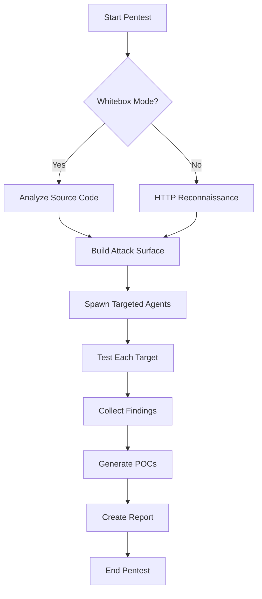

The `pentest` command executes a complete penetration test workflow, including attack surface discovery and targeted vulnerability assessment.

## Syntax

```bash
pensar pentest --target <url> [options]
```

## Description

This command runs a comprehensive two-phase pentest:

1. **Attack Surface Discovery**: Identifies all testable endpoints, parameters, and attack vectors
2. **Targeted Exploitation**: Spawns specialized agents to test each discovered target

Supports both **blackbox** (external testing) and **whitebox** (source code analysis) modes.

## Required Options

<ParamField path="--target" type="string" required>
  Target URL, domain, or IP address to test
  
  **Examples**:
  - `https://example.com`
  - `http://192.168.1.100:8080`
  - `example.com` (assumes HTTPS)
</ParamField>

## Optional Parameters

<ParamField path="--cwd" type="string">
  Path to source code directory for whitebox testing
  
  When provided, Pensar analyzes the source code to build a comprehensive attack surface map, enabling deeper vulnerability discovery.
  
  **Default**: None (blackbox mode)
  
  **Example**:
  ```bash
  --cwd /path/to/project/src
  ```
</ParamField>

<ParamField path="--mode" type="string">
  Pentest mode configuration
  
  **Supported values**:
  - `exfil` - Exfiltration mode with pivoting and flag extraction
  
  **Default**: Standard pentest mode
  
  **Example**:
  ```bash
  --mode exfil
  ```
  
  <Note>
    Exfiltration mode is designed for CTF-style challenges and authorized red team exercises where the goal is to extract specific flags or data.
  </Note>
</ParamField>

<ParamField path="--model" type="string">
  AI model to use for security analysis
  
  **Default**: `claude-sonnet-4-5`
  
  **Supported models**:
  - `claude-sonnet-4-5` (recommended)
  - `claude-opus-4-0`
  - `gpt-4o`
  - `gpt-4-turbo`
  - Custom models via OpenRouter or local vLLM
  
  **Example**:
  ```bash
  --model gpt-4o
  ```
</ParamField>

## Examples

### Basic Blackbox Pentest

Test a web application without source code access:

```bash
pensar pentest --target https://example.com
```

**Output**:
```
============================================================
PENTEST ORCHESTRATION
============================================================
Target:  https://example.com
Model:   claude-sonnet-4-5

→ Discovering attack surface...
✓ Found 47 endpoints
✓ Identified 12 authentication points

→ Starting targeted pentests...
→ Testing /api/users endpoint
✓ Found SQL injection in user_id parameter
→ Testing /admin panel
✓ Found authorization bypass

============================================================
RESULTS
============================================================
Findings:  8
Path:      /home/user/.pensar/sessions/abc123/findings.json
POCs:      /home/user/.pensar/sessions/abc123/pocs/
Report:    /home/user/.pensar/sessions/abc123/report.md
```

### Whitebox Pentest with Source Code

Analyze source code for comprehensive vulnerability discovery:

```bash
pensar pentest \
  --target https://staging.example.com \
  --cwd /path/to/project/src
```

**Output**:
```
============================================================
PENTEST ORCHESTRATION
============================================================
Target:  https://staging.example.com
Cwd:     /path/to/project/src (whitebox)
Model:   claude-sonnet-4-5

→ Analyzing source code...
✓ Found 127 API routes
✓ Identified 23 database queries
✓ Mapped 8 authentication flows

→ Testing discovered attack surface...
→ Testing SQLAlchemy query in /api/search
✓ Found SQL injection via unsanitized input
→ Testing JWT validation in auth middleware
✓ Found weak secret key configuration

============================================================
RESULTS
============================================================
Findings:  15
Path:      /home/user/.pensar/sessions/def456/findings.json
POCs:      /home/user/.pensar/sessions/def456/pocs/
Report:    /home/user/.pensar/sessions/def456/report.md
```

### Exfiltration Mode (CTF/Red Team)

Run pentest with pivoting and flag extraction:

```bash
pensar pentest \
  --target http://ctf.example.com \
  --mode exfil
```

**Output**:
```
============================================================
PENTEST ORCHESTRATION
============================================================
Target:  http://ctf.example.com
Mode:    exfil
Model:   claude-sonnet-4-5

→ Discovering attack surface...
✓ Found initial foothold: /debug endpoint
→ Attempting privilege escalation...
✓ Gained admin access via IDOR
→ Searching for flags...
✓ Extracted flag: CTF{s3cur1ty_1s_h4rd}
→ Attempting lateral movement...
✓ Found internal network access

============================================================
RESULTS
============================================================
Findings:  12
Path:      /home/user/.pensar/sessions/ghi789/findings.json
POCs:      /home/user/.pensar/sessions/ghi789/pocs/
Report:    /home/user/.pensar/sessions/ghi789/report.md
```

### Custom Model Selection

Use a different AI model:

```bash
pensar pentest \
  --target https://example.com \
  --model gpt-4o
```

### CI/CD Integration

Run automated security testing in CI/CD pipelines:

```bash
#!/bin/bash
set -e

# Run pentest
pensar pentest \
  --target "https://staging.${CI_ENVIRONMENT}.example.com" \
  --model claude-sonnet-4-5 > pentest.log

# Check for critical vulnerabilities
if grep -q '"severity": "critical"' ~/.pensar/sessions/*/findings.json; then
  echo "Critical vulnerabilities found!"
  exit 1
fi
```

## Output Files

The pentest command generates structured output in the session directory:

### findings.json

JSON file containing all discovered vulnerabilities:

```json
[
  {
    "id": "vuln-001",
    "title": "SQL Injection in User Search",
    "severity": "critical",
    "cvss": 9.8,
    "description": "The /api/users/search endpoint is vulnerable to SQL injection...",
    "poc": "pocs/sql-injection-users-search.py",
    "remediation": "Use parameterized queries or an ORM..."
  }
]
```

### pocs/

Directory containing proof-of-concept exploit scripts:

```bash
pocs/
├── sql-injection-users-search.py
├── auth-bypass-admin-panel.sh
└── xss-comment-field.html
```

Each POC is a runnable script demonstrating the vulnerability.

### report.md

Human-readable markdown report:

```markdown
# Security Assessment Report

## Executive Summary

Pentest completed on 2026-03-05 against https://example.com
Found 8 vulnerabilities: 2 critical, 3 high, 2 medium, 1 low

## Findings

### 1. SQL Injection in User Search (Critical)

**CVSS**: 9.8
**Location**: /api/users/search
...
```

## Use Cases

<Tabs>
  <Tab title="Web Application Security">
    Test web applications for common vulnerabilities:
    
    ```bash
    pensar pentest --target https://webapp.example.com
    ```
    
    Discovers:
    - SQL injection
    - XSS vulnerabilities
    - Authentication bypasses
    - Authorization flaws
    - API security issues
  </Tab>
  
  <Tab title="API Security Testing">
    Comprehensive API vulnerability assessment:
    
    ```bash
    pensar pentest --target https://api.example.com/v1
    ```
    
    Tests:
    - REST API endpoints
    - GraphQL queries
    - Authentication mechanisms
    - Rate limiting
    - Input validation
  </Tab>
  
  <Tab title="Code-Assisted Pentest">
    Deep security analysis with source code:
    
    ```bash
    pensar pentest \
      --target https://staging.example.com \
      --cwd /path/to/source
    ```
    
    Enables:
    - Complete attack surface mapping
    - Code-level vulnerability detection
    - Logic flaw identification
    - Configuration audit
  </Tab>
  
  <Tab title="CTF Challenges">
    Automated CTF flag extraction:
    
    ```bash
    pensar pentest \
      --target http://ctf-challenge.local \
      --mode exfil
    ```
    
    Performs:
    - Automated exploitation
    - Privilege escalation
    - Lateral movement
    - Flag extraction
  </Tab>
</Tabs>

## Pentest Workflow

The pentest command follows a structured workflow:



## Environment Variables

<ParamField path="ANTHROPIC_API_KEY" type="string">
  API key for Claude models (recommended for best results)
</ParamField>

<ParamField path="OPENAI_API_KEY" type="string">
  API key for GPT models
</ParamField>

<ParamField path="OPENROUTER_API_KEY" type="string">
  API key for OpenRouter multi-model access
</ParamField>

## Troubleshooting

### No Vulnerabilities Found

If the pentest completes with no findings:

1. **Verify target is accessible**:
   ```bash
   curl -v https://example.com
   ```

2. **Try whitebox mode** if you have source code:
   ```bash
   pensar pentest --target https://example.com --cwd /path/to/source
   ```

3. **Check session logs** for errors:
   ```bash
   cat ~/.pensar/sessions/*/agent.log
   ```

### Authentication Required

For targets requiring authentication:

1. Launch the TUI and use the authentication wizard:
   ```bash
   pensar
   # Navigate to Operator Dashboard > Configure Auth
   ```

2. Or use [targeted-pentest](/commands/targeted-pentest) with manual session setup

### Rate Limiting

If you encounter rate limiting:

```bash
# Pensar automatically handles rate limits, but you can:
# 1. Wait and retry
# 2. Use a different IP or proxy
# 3. Reduce concurrency (feature coming soon)
```

## Related Commands

- [targeted-pentest](/commands/targeted-pentest) - Focused testing with specific objectives
- [pensar](/commands/pensar) - Interactive TUI with manual control
- [doctor](/commands/doctor) - Verify system configuration

## Next Steps

<CardGroup cols={2}>
  <Card title="Interpreting Results" icon="magnifying-glass" href="/guides/interpreting-results">
    Learn how to analyze pentest findings
  </Card>
  <Card title="Writing POCs" icon="code" href="/guides/pocs">
    Customize and validate proof-of-concept exploits
  </Card>
</CardGroup>