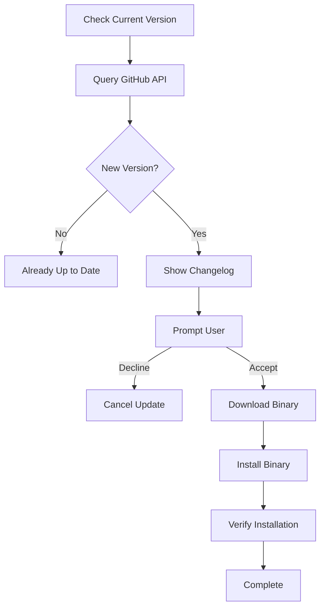

The `upgrade` command checks for and installs the latest version of Pensar Apex.

## Syntax

```bash
pensar upgrade
```

**Alias**: `pensar update`

## Description

The upgrade command:

1. Checks your current Pensar version
2. Queries GitHub for the latest release
3. Downloads and installs the update if available
4. Verifies the installation

The upgrade process is **interactive** and will prompt you before making changes.

## No Options Required

The `upgrade` command runs without any flags or options:

```bash
pensar upgrade
```

Or using the alias:

```bash
pensar update
```

## Examples

### Check for Updates

Run the upgrade command to check for new versions:

```bash
pensar upgrade
```

**Output (when update available)**:
```
Current version: v0.0.79
Checking for updates...

New version available: v0.0.80

Changelog:
- Fixed SQL injection detection accuracy
- Added support for GraphQL pentesting
- Improved rate limiting handling
- Performance optimizations

Download and install v0.0.80? [Y/n] 
```

**Output (when up to date)**:
```
Current version: v0.0.79
Checking for updates...

You are already running the latest version!
```

### Automatic Update

Accept the update prompt to install:

```bash
$ pensar upgrade

Current version: v0.0.79
Checking for updates...

New version available: v0.0.80

Download and install v0.0.80? [Y/n] y

→ Downloading pensar v0.0.80...
✓ Downloaded successfully
→ Installing...
✓ Installed successfully
→ Verifying installation...
✓ Verified

Successfully upgraded to v0.0.80!

Run 'pensar version' to verify.
```

### Decline Update

Skip the update by answering 'n':

```bash
$ pensar upgrade

Current version: v0.0.79
Checking for updates...

New version available: v0.0.80

Download and install v0.0.80? [Y/n] n

Update cancelled.
```

### Using the Alias

The `update` command works identically:

```bash
pensar update
```

## Update Process

The upgrade follows these steps:



## Installation Locations

Pensar is installed to different locations based on your installation method:

<Tabs>
  <Tab title="Shell Script Install">
    **Default location**: `~/.pensar/bin/pensar`
    
    The upgrade command updates the binary in place:
    ```bash
    ~/.pensar/bin/pensar
    ```
    
    Make sure this is in your PATH:
    ```bash
    export PATH="$HOME/.pensar/bin:$PATH"
    ```
  </Tab>
  
  <Tab title="Homebrew">
    **Location**: Managed by Homebrew
    
    If installed via Homebrew:
    ```bash
    brew upgrade pensar
    ```
    
    The `pensar upgrade` command will detect Homebrew and suggest using `brew upgrade` instead.
  </Tab>
  
  <Tab title="NPM/Yarn">
    **Location**: Managed by package manager
    
    If installed via npm or yarn:
    ```bash
    npm update -g @pensar/apex
    # or
    yarn global upgrade @pensar/apex
    ```
    
    The `pensar upgrade` command will detect npm/yarn and suggest using the package manager instead.
  </Tab>
  
  <Tab title="Manual Binary">
    **Location**: Custom
    
    If you manually downloaded and placed the binary:
    
    ```bash
    # The upgrade command will attempt to update it in place
    # If it fails, download manually:
    curl -L https://github.com/pensarai/apex/releases/latest/download/pensar-$(uname -s)-$(uname -m) -o pensar
    chmod +x pensar
    ```
  </Tab>
</Tabs>

## Version Checking

Check your current version without upgrading:

```bash
pensar version
# or
pensar -v
# or
pensar --version
```

**Output**:
```
v0.0.79
```

## Release Channels

Pensar has two release channels:

### Stable (Default)

The upgrade command installs stable releases:

```bash
pensar upgrade
```

Stable releases are:
- Thoroughly tested
- Production-ready
- Recommended for most users

### Canary (Bleeding Edge)

For the latest features (may be unstable):

```bash
# Manual installation required
curl -L https://github.com/pensarai/apex/releases/download/canary/pensar-$(uname -s)-$(uname -m) -o ~/.pensar/bin/pensar
chmod +x ~/.pensar/bin/pensar
```

<Warning>
  Canary releases may contain bugs and breaking changes. Only use for testing or development.
</Warning>

## Rollback

If you need to rollback to a previous version:

### Method 1: Specific Version

```bash
# Download a specific version
curl -L https://github.com/pensarai/apex/releases/download/v0.0.79/pensar-$(uname -s)-$(uname -m) -o ~/.pensar/bin/pensar
chmod +x ~/.pensar/bin/pensar

# Verify
pensar version
```

### Method 2: Previous Version

```bash
# List available versions
curl -s https://api.github.com/repos/pensarai/apex/releases | grep '"tag_name"'

# Download desired version
curl -L https://github.com/pensarai/apex/releases/download/v0.0.78/pensar-$(uname -s)-$(uname -m) -o ~/.pensar/bin/pensar
chmod +x ~/.pensar/bin/pensar
```

## Automatic Updates

Pensar checks for updates automatically:

- **TUI**: Shows notification on launch if update available
- **CLI**: Displays update message after command completion

### Disable Update Check

To disable automatic update checks:

```bash
# Edit config file
vim ~/.pensar/config.json

# Add:
{
  "checkForUpdates": false
}
```

## Update Notifications

When an update is available, you'll see a notification:

```bash
$ pensar pentest --target https://example.com

╭─────────────────────────────────────────────╮
│ Update available: v0.0.80                   │
│ Run 'pensar upgrade' to update              │
╰─────────────────────────────────────────────╯

============================================================
PENTEST ORCHESTRATION
============================================================
...
```

## Exit Codes

| Code | Meaning |
|------|----------|
| `0` | Success (updated or already up to date) |
| `1` | Failure (download failed, installation failed, etc.) |

```bash
pensar upgrade
echo $?  # Check exit code
```

## Use Cases

### Regular Maintenance

Keep Pensar up to date:

```bash
# Weekly update check
pensar upgrade
```

### Before Critical Pentests

Ensure you have the latest security improvements:

```bash
# Update before important work
pensar upgrade && pensar pentest --target https://example.com
```

### CI/CD Pipeline

Always use the latest version in automation:

```bash
#!/bin/bash
set -e

# Install or update Pensar
if command -v pensar &> /dev/null; then
  pensar upgrade
else
  curl -fsSL https://raw.githubusercontent.com/pensarai/apex/main/install.sh | sh
fi

# Run pentest
pensar pentest --target "$TARGET_URL"
```

### Development Testing

Test against the latest version:

```bash
# Upgrade to latest
pensar upgrade

# Test your workflow
pensar pentest --target https://staging.example.com
```

## Troubleshooting

### Download Fails

If the download fails:

```bash
# Check internet connection
ping github.com

# Try manual download
curl -L https://github.com/pensarai/apex/releases/latest/download/pensar-$(uname -s)-$(uname -m) -o /tmp/pensar
chmod +x /tmp/pensar
mv /tmp/pensar ~/.pensar/bin/pensar
```

### Permission Denied

If installation fails with permission errors:

```bash
# Check permissions
ls -la ~/.pensar/bin/pensar

# Fix permissions
chmod +x ~/.pensar/bin/pensar

# If directory doesn't exist:
mkdir -p ~/.pensar/bin
```

### Version Not Changing

If `pensar version` shows old version after upgrade:

```bash
# Check which pensar binary is being used
which pensar

# May show system-wide install instead of user install
# Update your PATH:
export PATH="$HOME/.pensar/bin:$PATH"

# Add to shell profile for persistence:
echo 'export PATH="$HOME/.pensar/bin:$PATH"' >> ~/.bashrc
source ~/.bashrc
```

### Network Issues

If you're behind a proxy or firewall:

```bash
# Set proxy environment variables
export HTTP_PROXY="http://proxy.example.com:8080"
export HTTPS_PROXY="http://proxy.example.com:8080"

# Then upgrade
pensar upgrade
```

### Rate Limiting

GitHub API rate limits may affect update checks:

```bash
# Check rate limit status
curl -s https://api.github.com/rate_limit

# Wait an hour or authenticate with GitHub token
export GITHUB_TOKEN="your-token-here"
pensar upgrade
```

## Configuration

Upgrade behavior can be configured in `~/.pensar/config.json`:

```json
{
  "updates": {
    "checkForUpdates": true,
    "autoDownload": false,
    "channel": "stable",
    "notifyOnLaunch": true
  }
}
```

<ParamField path="checkForUpdates" type="boolean" default="true">
  Enable automatic update checking
</ParamField>

<ParamField path="autoDownload" type="boolean" default="false">
  Automatically download updates (still requires confirmation to install)
</ParamField>

<ParamField path="channel" type="string" default="stable">
  Release channel: `stable` or `canary`
</ParamField>

<ParamField path="notifyOnLaunch" type="boolean" default="true">
  Show update notifications when launching Pensar
</ParamField>

## Related Commands

- [doctor](/commands/doctor) - Verify system configuration after upgrade
- [pensar](/commands/pensar) - Launch TUI with updated version
- [version](/commands/overview) - Check current version

## Next Steps

<CardGroup cols={2}>
  <Card title="Changelog" icon="list" href="https://github.com/pensarai/apex/releases">
    View all release notes and changes
  </Card>
  <Card title="GitHub Releases" icon="github" href="https://github.com/pensarai/apex/releases">
    Download specific versions manually
  </Card>
</CardGroup>