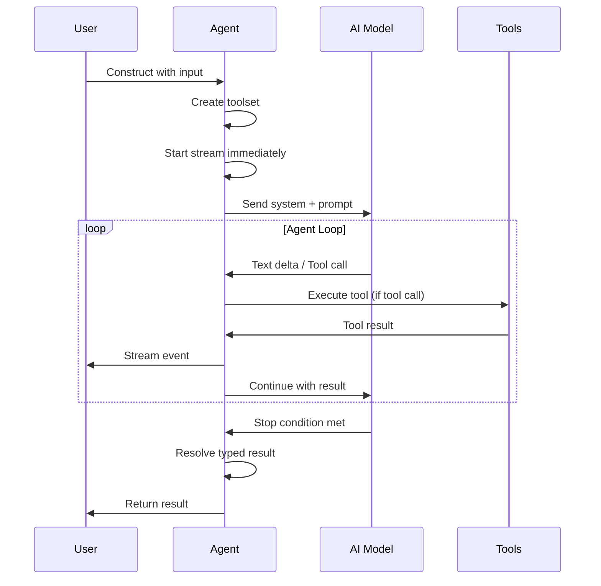

## Overview

Pensar Apex is built on an **autonomous agent architecture** powered by large language models. Rather than following rigid scripts, the tool uses AI agents that reason about targets, plan testing strategies, and execute security assessments adaptively.

At the core is the **OffensiveSecurityAgent** harness, a general-purpose agent framework that manages the interaction between AI models and security testing tools. Specialized agents extend this harness with domain-specific behavior for different phases of testing.

## Agent Harness

The `OffensiveSecurityAgent` class provides the foundation for all testing agents:

```typescript
export class OffensiveSecurityAgent<TResult = void> {
  /** The underlying Vercel AI SDK stream result */
  public readonly streamResult: StreamTextResult<ToolSet, never>;

  constructor(input: OffensiveSecurityAgentInput<TResult>) {
    // Stream starts immediately on construction
  }

  /** Consume the stream with typed callbacks */
  async consume(callbacks: ConsumeCallbacks = {}): Promise<TResult>

  /** Makes the agent async-iterable */
  async *[Symbol.asyncIterator](): AsyncIterator<TextStreamPart<ToolSet>>
}
```

### Key Features

<CardGroup cols={2}>
  <Card title="Tool Management" icon="wrench">
    The harness owns tool creation and activation. Specialized agents declare which tools they need via the `activeTools` array.
  </Card>
  
  <Card title="Streaming Architecture" icon="stream">
    Agents start streaming immediately on construction. Consume via callbacks, `for await`, or raw stream access.
  </Card>
  
  <Card title="Typed Results" icon="code">
    Use `resolveResult` or `responseSchema` to get strongly-typed outputs from agent runs.
  </Card>
  
  <Card title="Approval Gates" icon="shield-check">
    Optional operator approval for tool calls enables human-in-the-loop workflows.
  </Card>
</CardGroup>

## Agent Input Configuration

All agents accept a common input structure:

```typescript
export type OffensiveSecurityAgentInput<TResult = void> = {
  /** System prompt defining agent persona and behavior */
  system: string;

  /** Initial user prompt that kicks off the agent */
  prompt: string;

  /** AI model identifier */
  model: AIModel;

  /** Session providing paths for findings, POCs, logs */
  session: SessionInfo;

  /** Target URL / host */
  target?: string;

  /** Which tools the agent is allowed to use */
  activeTools: (ToolName | (string & {}))[];

  /** Additional tools to merge into the toolset */
  extraTools?: ToolSet;

  /** Condition(s) under which the agent should stop */
  stopWhen?: StopCondition<ToolSet> | StopCondition<ToolSet>[];

  /** Shared findings registry for cross-agent dedup */
  findingsRegistry?: FindingsRegistry;

  /** Sandbox for isolated tool execution */
  sandbox?: UnifiedSandbox;

  /** Per-provider API key overrides */
  authConfig?: AIAuthConfig;
};
```

## Specialized Agents

Pensar Apex includes four specialized agent types, each optimized for a specific phase of security testing:

### Attack Surface Agent

**Purpose:** Discover and map the entire attack surface of a target

**Location:** `src/core/agents/specialized/attackSurface/`

```typescript
export class BlackboxAttackSurfaceAgent extends OffensiveSecurityAgent<AttackSurfaceResult> {
  constructor(opts: AttackSurfaceAgentInput) {
    super({
      system: ATTACK_SURFACE_SYSTEM_PROMPT,
      prompt: buildPrompt(target, session),
      model,
      session,
      target,
      activeTools: [
        "execute_command",      // Recon tools (nmap, dig, curl)
        "document_asset",       // Track discovered assets
        "browser_navigate",     // Explore SPAs and JS-heavy apps
        "browser_snapshot",     // Capture DOM state
        "browser_screenshot",   // Visual evidence
        "create_attack_surface_report", // Final report
      ],
      stopWhen: hasToolCall("create_attack_surface_report"),
    });
  }
}
```

**Output:** `AttackSurfaceResult`
- Discovered assets (domains, services, endpoints)
- Identified authentication flows
- Prioritized targets for deep testing
- Attack surface analysis report

<Tip>
  The attack surface agent operates in two modes:
  - **Blackbox:** Probes a live target from the outside (no source code access)
  - **Whitebox:** Analyzes source code directly to extract endpoints and routes
</Tip>

### Authentication Agent

**Purpose:** Handle authentication and session management

**Location:** `src/core/agents/specialized/authenticationAgent/`

```typescript
export class AuthenticationAgent extends OffensiveSecurityAgent<AuthenticationResult> {
  constructor(opts: AuthenticationAgentInput) {
    super({
      system: AUTH_SUBAGENT_SYSTEM_PROMPT,
      prompt: buildAuthPrompt(target, authHints, credentialManager),
      model,
      session,
      target,
      activeTools: [
        "execute_command",
        "authenticate_session",    // Automated auth attempts
        "complete_authentication", // Persist session state
        "browser_navigate",
        "browser_click",           // Interactive form testing
        "browser_fill",            // Secure credential input
        "browser_get_cookies",     // Extract session tokens
      ],
      stopWhen: hasToolCall("complete_authentication"),
    });
  }
}
```

**Output:** `AuthenticationResult`
- Success status
- Authentication strategy used
- Exported cookies and headers
- Session persistence data

<Note>
  The authentication agent never sees raw credentials. It uses a `CredentialManager` that resolves credential IDs to secrets at execution time, keeping sensitive data out of agent prompts and logs.
</Note>

### Pentest Agent

**Purpose:** Perform targeted vulnerability testing against specific endpoints

**Location:** `src/core/agents/specialized/pentest/`

```typescript
export class TargetedPentestAgent extends OffensiveSecurityAgent<PentestResult> {
  constructor(opts: PentestAgentInput) {
    super({
      system: buildSystemPrompt(session),
      prompt: buildPrompt(target, objectives, session, findingsRegistry),
      model,
      session,
      target,
      sandbox,
      findingsRegistry,
      activeTools: [
        "execute_command",         // Exploit crafting
        "http_request",            // Targeted web requests
        "document_vulnerability",  // Persist findings
        "create_poc",              // Proof-of-concept scripts
        "browser_navigate",
        "browser_click",
        "browser_fill",            // Interactive exploitation
        "response",                // Structured completion
      ],
      responseSchema: PentestResponseSchema,
    });
  }
}
```

**Output:** `PentestResult`
- Discovered vulnerabilities
- Proof-of-concept scripts
- Evidence and impact analysis
- Remediation guidance

<Warning>
  The pentest agent operates in **blackbox mode** — it never reads source code. It tests targets purely through external interaction: HTTP requests, browser automation, and observable behavior.
</Warning>

### Offensive Security Agent (General)

**Purpose:** Orchestrate complex workflows and delegate to specialized agents

**Location:** `src/core/agents/offSecAgent/`

The base `OffensiveSecurityAgent` can be used directly for custom workflows that don't fit the specialized agent patterns. It has access to all tools and can:

- Orchestrate multi-phase testing campaigns
- Delegate to specialized agents via `delegate_to_auth_subagent`
- Run custom testing methodologies
- Integrate with external tools and services

## Agent Communication

Agents communicate through several mechanisms:

### Parent-Child Delegation

Parent agents can spawn specialized child agents:

```typescript
// Parent agent delegates authentication to a subagent
{
  tool: "delegate_to_auth_subagent",
  args: { target: "https://example.com" }
}
```

### Shared State

Agents share state through the session:

- **Findings Registry:** Prevents duplicate vulnerability reports across agents
- **Credential Manager:** Secure credential sharing without exposing secrets
- **Session Storage:** Persistent files (POCs, screenshots, reports)

### Stream Events

Agents emit typed stream events that can be consumed by parents:

```typescript
const agent = new PentestAgent(input);

await agent.consume({
  onTextDelta: (d) => console.log(d.text),
  onToolCall: (d) => console.log(`→ ${d.toolName}`),
  onToolResult: (d) => console.log(`✓ ${d.toolName} completed`),
  subagentCallbacks: {
    onSubagentSpawn: ({ subagentId, status }) => {
      console.log(`Subagent ${subagentId} spawned: ${status}`);
    },
  },
});
```

## Agent Lifecycle



1. **Construction:** Agent is instantiated with input configuration
2. **Tool Creation:** Harness builds the toolset based on `activeTools`
3. **Stream Start:** AI SDK stream begins immediately
4. **Agent Loop:** Model reasons, calls tools, receives results, continues
5. **Stop Condition:** Agent stops when condition is met (tool call, step count, etc.)
6. **Result Resolution:** `resolveResult` or `responseSchema` produces typed output

## Usage Example

Here's how to use the specialized agents:

```typescript
import { sessions } from "@/core/session";
import { BlackboxAttackSurfaceAgent } from "@/core/agents/specialized/attackSurface";
import { AuthenticationAgent } from "@/core/agents/specialized/authenticationAgent";
import { TargetedPentestAgent } from "@/core/agents/specialized/pentest";

// Create a session
const session = await sessions.create({
  name: "Security Assessment",
  targets: ["https://example.com"],
  config: {
    authCredentials: {
      username: "testuser",
      password: "testpass",
      loginUrl: "https://example.com/login",
    },
  },
});

// Phase 1: Discover attack surface
const attackSurfaceAgent = new BlackboxAttackSurfaceAgent({
  target: "https://example.com",
  model: "claude-sonnet-4-20250514",
  session,
});

const { targets } = await attackSurfaceAgent.consume({
  onTextDelta: (d) => process.stdout.write(d.text),
});

// Phase 2: Authenticate
const authAgent = new AuthenticationAgent({
  target: "https://example.com",
  model: "claude-sonnet-4-20250514",
  session,
});

const { success } = await authAgent.consume({
  onTextDelta: (d) => process.stdout.write(d.text),
});

// Phase 3: Test each target
for (const target of targets) {
  const pentestAgent = new TargetedPentestAgent({
    target: target.target,
    objectives: [target.objective],
    model: "claude-sonnet-4-20250514",
    session,
  });

  const { findings } = await pentestAgent.consume({
    onTextDelta: (d) => process.stdout.write(d.text),
  });

  console.log(`Found ${findings.length} vulnerabilities in ${target.target}`);
}
```

## Best Practices

<AccordionGroup>
  <Accordion title="Choose the Right Agent">
    - Use **AttackSurfaceAgent** for reconnaissance and discovery
    - Use **AuthenticationAgent** for login flows and session management
    - Use **PentestAgent** for targeted vulnerability testing
    - Use base **OffensiveSecurityAgent** only for custom workflows
  </Accordion>

  <Accordion title="Manage Agent State">
    - Share `FindingsRegistry` across agents to prevent duplicate reports
    - Use `CredentialManager` for secure credential handling
    - Store session data in the session directory for persistence
  </Accordion>

  <Accordion title="Handle Stream Events">
    - Always consume agent streams (callbacks, `for await`, or `.consume()`)
    - Forward subagent events to parent consumers when orchestrating
    - Handle errors gracefully with `onError` callbacks
  </Accordion>

  <Accordion title="Control Agent Execution">
    - Use `stopWhen` conditions to prevent infinite loops
    - Leverage `abortSignal` for user-initiated cancellation
    - Set up `approvalGate` for human-in-the-loop workflows
  </Accordion>
</AccordionGroup>

## Related Resources

<CardGroup cols={2}>
  <Card title="Attack Surface Discovery" icon="radar" href="/concepts/attack-surface">
    Learn how agents map your application's attack surface
  </Card>
  
  <Card title="Findings & Reports" icon="file-magnifying-glass" href="/concepts/findings">
    Understand vulnerability findings and deduplication
  </Card>
  
  <Card title="API Reference" icon="code" href="/api-reference/agents">
    Complete API documentation for all agent classes
  </Card>
  
  <Card title="Tool System" icon="toolbox" href="/concepts/tools">
    Explore the tools available to agents
  </Card>
</CardGroup>